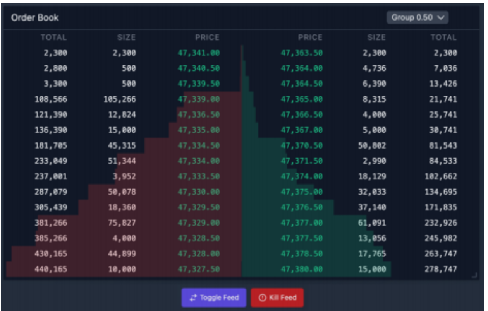
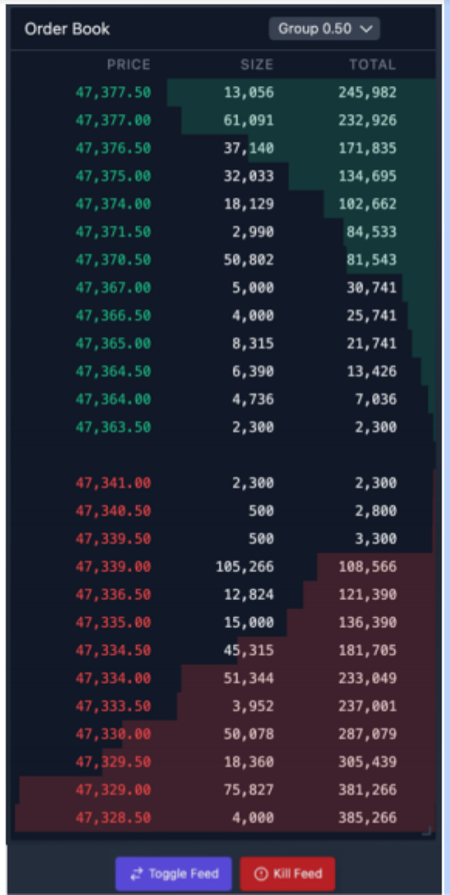

# Stockmarket Orderbook Challenge

### The Problem 

Stakeholders are requesting that we add a live orderbook to our trading interface that allows users to visualize the interest in their selected market whilst they create new orders, aligning our trading interface with what our competitors in the market offer. 

### The Solution 

Create a small application containing an orderbook to display to stakeholders that we can deliver on the functionality required by the business. We have the freedom to use any build toolchain or helper libraries necessary, but we must stick to our core technologies of TypeScript + React/React Native and work under the assumption that the patterns and implementation details used here will set the standards for the rest of our user interface. 

The orderbook will be made up of four main parts and mirror the following design: 

 

#### Desktop Design 

  

 

#### Mobile Design  

 
 

### Part 1: The Orderbook 

The orderbook consists of two sides: the buy side and the sell side. Both sides contain information about the amount of orders open at each price level. 
 

Each level displays the: 
 

● Price - this is what defines the level. As orders must be placed at a price that is a multiple of the selected markets tick size (0.5) each level will be an increment of 0.5 (as long as there is an order open at that level). 
 

● Size - the total quantity of contracts derived from open orders that have been placed at this level. 
 

● Total - the summed amount of contracts derived from open orders that reside in the book at this level and above. To calculate the total of a given level we take the size of the current level and sum the sizes leading to this price level in the order book. The total is also used to calculate the depth visualizer (colored bars behind the levels), the depth of each level is calculated by taking that level's total as a percentage of the highest total in the book. 
 

To retrieve the data feed necessary to build the orderbook we’ll be using the following public WebSocket: `wss://www.cryptofacilities.com/ws/v1` and sending the following message to this WebSocket: `{"event":"subscribe","feed":"book_ui_1","product_ids":["PI_XBTUSD"]}`. 
 

This data feed first returns a snapshot of state representing the existing state of the entire orderbook followed by deltas representing singular updates to levels within the book. The orders returned by the feed are in the format of [price, size][]. If the size returned by a delta is 0 then that price level should be removed from the orderbook, otherwise you can safely overwrite the state of that price level with new data returned by that delta. 
 

### Part 2: Grouping Select Box 

By default the orders are grouped by the select markets ticket size (0.5). We need to be able to toggle this grouping between 0.5, 1 and 2.5. To group levels we combine the levels rounded down to the nearest group size e.g. if we change our grouping from 0.5 to 1 then we would combine the data from prices 1000 and 1000.5 and display it under a single level in the orderbook with the price 1000. 
 
 

### Part 3: Toggle Feed Button 

Clicking this button should toggle the selected market between PI_XBTUSD and PI_ETHUSD. To switch contracts we need to unsubscribe from our existing data feed by sending the following message:`{"event":"unsubscribe","feed":"book_ui_1","product_ids":["PI_XBTUSD"]}` and resubscribe to the new feed using the same subscribe originally sent but with the new product_id **PI_ETHUSD**. 
Please note that these markets use different tick sizes, 0.5 for **PI_XBTUSD** and 0.05 for **PI_ETHUSD** so your grouping logic must be dynamic and handle groups for **XBT (0.5, 1, 2.5)** and groupings for **ETH (0.05, 0.1, 0.25)**.
 
 

### Part 4: Kill Feed Button 

Clicking this button should force the WebSocket feed to throw an error. This is purely so we can see how you’re handling error events. Clicking this button a second time should restart the feed. 
 
 

## Success Criteria 

1. Application architecture and framework best practices for the framework in use are followed and understood. 
2. All necessary areas of the codebase are strictly typed, and definitions are logically named and reused where possible. 
3. Code is formatted well and easy to follow. Variable and function names make sense.
4. Any dependencies that have been added have logical reasons for their inclusion, and have been implemented correctly. 
5. Understanding of client side state management is displayed. 
6. Rendering performance is clearly considered and the application UI runs smoothly on all evergreen browsers and low end devices. 
7. Application gracefully handles WebSocket error cases and is resistant to unexpected messages. 
8. Application considers that the WebSocket data throughput can fluctuate and dramatically increase during high trading volatility. It has mechanisms in place to ensure the UI can not be overworked and slow down due to processing this data. 
9. Test coverage of the orderbook responses is sufficient and thought has been put into what areas of the application should and shouldn’t be tested. 
